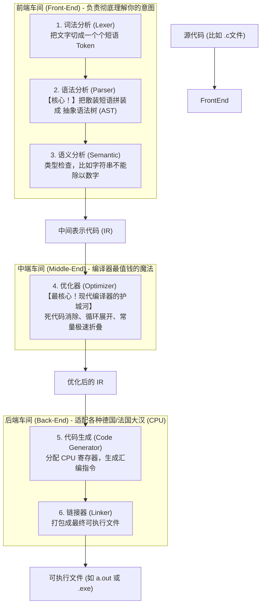

# 现代编译器的三大核心战区 (The Compiler Pipeline)

如果咱们把这个“翻译公司（编译器）”的大门踹开，去参观内部完整的流水线。你会发现它大致分为三个车间。这就是大名鼎鼎的 **LLVM 架构**（也是你 Mac 电脑上苹果御用编译器 Clang 的底层骨架）所采用的黄金分割。

在整个编译器中，**最重要的（也是最难、最花钱的）是“中端优化器 (Optimizer)”和“语法分析生成 AST (Parser)”。**



---

## 编译器最重要的两个“神级部件”拆解：

### 第一部件：语法分析与 AST 树 (Parser & AST) — 逻辑的终点
如果你写了这么一句代码：`int result = x * 2 + y;`
翻译公司不能直接按顺序翻译。因为如果是纯从左到右，可能是 `(x * 2) + y`，也可能是 `x * (2 + y)`。

所以，Parser 必须根据加减乘除的优先级，在你写出的纯文本字典上，倒腾出一棵树（**AST，抽象语法树**）。
对于 `x * 2 + y`，这棵树长这样：
1. 树的顶端（树根）是一个 `+` 号。
2. `+` 号的左边树杈，是一整个运算 `*` 号，而这个 `*` 号下面挂着 `x` 和 `2`。
3. `+` 号的右边树杈，挂着 `y`。
**AST 是人类高级逻辑和机器语言分界的核心坐标系！** 到这棵树建出来为止，编译器就已经 100% 懂你的“中文菜谱”逻辑了。

### 第二部件：优化器 (Optimizer) — 大厂的命脉
一门语言好不好，除了语法优美，更看它的编译器**聪不聪明**。这都在优化器里。

假如你写了一段很傻的代码：
```c
int a = 100;
int b = 200;
int c = a + b;
for(int i=0; i<1000; i++) {
    print(c);
}
```
普通的编译器翻译过去后，CPU 真的会去内存里去算 100+200，然后死磕跑一千圈。
但是！现代的顶级 C++ 优化器（如开启了 `-O3` 级别的 GCC 编译器）在这个车间看到这堆代码时，它会当场帮你“改写菜谱”。
它发现 `a` 和 `b` 根本没变过，它会在编译阶段直接算好 `300`，不仅如此，它连内存都不分配了，直接把 `300` 烙印在打印机的指令里。你写的 5 行代码，通过优化器被**原地折叠压缩成了 1 行机器指令**。

所以我们说，**高级程序员和编译器的优化器，是互相配合的战友。** 优化器就是这家翻译公司里，那个懂统筹规划、甚至能挑出你逻辑毛病的高级总监。
